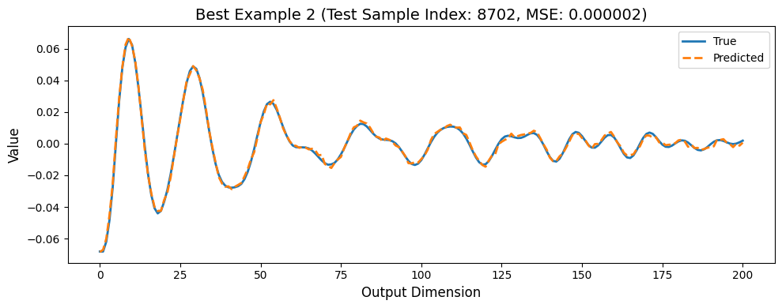

# Surge
A repo for demonstrating the efficacy of NN surrogate models for XAS simulation

# Neural Network for Predicting EXAFS from RDF Data Using PyTorch

This repository contains code for training a neural network model to predict Extended X-ray Absorption Fine Structure (EXAFS) data from Radial Distribution Function (RDF) data using PyTorch. The model is designed to learn the complex mapping between RDF inputs and EXAFS outputs, which has applications in material science and computational chemistry.

## Table of Contents

- [Introduction](#introduction)
- [Prerequisites](#prerequisites)
- [Dataset Preparation](#dataset-preparation)
- [Model Architecture](#model-architecture)
- [Training Procedure](#training-procedure)
- [Evaluation and Results](#evaluation-and-results)
  - [Euclidean Distance Plot](#euclidean-distance-plot)
  - [Histogram of Euclidean Distances](#histogram-of-euclidean-distances)
  - [Best and Worst Predictions](#best-and-worst-predictions)

## Introduction

This project aims to build a neural network that can predict EXAFS spectra from RDF data. The EXAFS technique is widely used to determine the local structural information of materials, and being able to predict EXAFS from RDF can significantly accelerate material analysis.

The model utilizes convolutional neural networks (CNNs) to capture spatial hierarchies in the RDF data and fully connected layers to map the extracted features to the EXAFS outputs.

## Prerequisites

- Python 3.6 or higher
- PyTorch
- NumPy
- Matplotlib
- scikit-learn

## Dataset Preparation

The dataset consists of RDF and EXAFS examples stored in NumPy arrays:

```python
rdf_examples = rdf_array
exafs_examples = chi_array
```
We split the data into training and testing sets:
```python
from sklearn.model_selection import train_test_split
```

## Model Architecture
The neural network model is defined using PyTorch's nn.Module. It consists of two 1D convolutional layers followed by three fully connected layers. The activation function used is hyperbolic tangent (Tanh).

```python
import torch
import torch.nn as nn

# Define the model
class Model2(nn.Module):
    def __init__(self):
        super(Model2, self).__init__()
        self.conv1 = nn.Conv1d(
            in_channels=3, out_channels=32, kernel_size=10, stride=2, padding=4
        )
        self.conv2 = nn.Conv1d(
            in_channels=32, out_channels=32, kernel_size=10, stride=1, padding=4
        )
        self.flatten = nn.Flatten()
        self.fc1 = nn.Linear(32 * 39, 600)
        self.fc2 = nn.Linear(600, 600)
        self.fc3 = nn.Linear(600, 201)
        self.tanh = nn.Tanh()

    def forward(self, x):
        x = x.view(-1, 240)    # Ensure input is of shape (batch_size, 240)
        x = x.view(-1, 3, 80)  # Reshape to (batch_size, 3, 80)
        x = self.conv1(x)
        x = self.tanh(x)
        x = self.conv2(x)
        x = self.tanh(x)
        x = self.flatten(x)
        x = self.fc1(x)
        x = self.tanh(x)
        x = self.fc2(x)
        x = self.tanh(x)
        x = self.fc3(x)
        return x

# Instantiate the model
model_nano_Au = Model2().to(device)
print(model_nano_Au)  # Print the model summary
```

# Training Procedure

We define the loss function, optimizer, and early stopping parameters:

```python
import torch.optim as optim

# Define loss function and optimizer
criterion = nn.MSELoss()
optimizer = optim.Adam(model_nano_Au.parameters(), lr=0.0001)

# Early stopping parameters
num_epochs = 100
patience = 10
min_delta = 0.0000003
best_val_loss = float('inf')
counter = 0
best_model_state = None
```
Training Loop with Early Stopping:
```python
# Training loop
for epoch in range(num_epochs):
    # Training
    model_nano_Au.train()
    train_loss = 0.0
    for inputs, targets in train_loader:
        inputs = inputs.to(device)
        targets = targets.to(device)

        optimizer.zero_grad()
        outputs = model_nano_Au(inputs)
        loss = criterion(outputs, targets)
        loss.backward()
        optimizer.step()
        train_loss += loss.item() * inputs.size(0)
    train_loss /= len(train_loader.dataset)

    # Validation
    model_nano_Au.eval()
    val_loss = 0.0
    with torch.no_grad():
        for inputs, targets in test_loader:
            inputs = inputs.to(device)
            targets = targets.to(device)

            outputs = model_nano_Au(inputs)
            loss = criterion(outputs, targets)
            val_loss += loss.item() * inputs.size(0)
    val_loss /= len(test_loader.dataset)

    print(
        f'Epoch [{epoch+1}/{num_epochs}], Train Loss: {train_loss:.8f}, Val Loss: {val_loss:.8f}'
    )

    # Early stopping check
    if val_loss + min_delta < best_val_loss:
        best_val_loss = val_loss
        counter = 0
        best_model_state = model_nano_Au.state_dict()
    else:
        counter += 1
        if counter >= patience:
            print('Early stopping triggered')
            model_nano_Au.load_state_dict(best_model_state)
            break
```
# Evaluation and Results
After training, we evaluate the model's performance on both the training and testing datasets. We compute the Euclidean distance and Mean Squared Error (MSE) between the predicted and true values for each sample.

## Euclidean Distance Plot
We plot the Euclidean distances for both training and test data:


## Best and Worst Predictions
We identify the 10 best and 10 worst predictions based on the MSE and visualize them:




